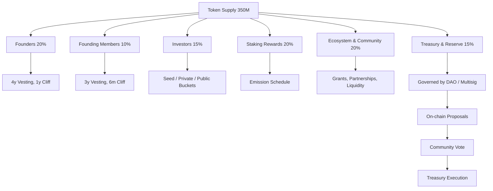

# Tokenomics Governance Diagram

```mermaid
graph TD
    A[Token Supply 350M] --> B[Founders 20%]
    A --> C[Founding Members 10%]
    A --> D[Investors 15%]
    A --> E[Staking Rewards 20%]
    A --> F[Ecosystem & Community 20%]
    A --> G[Treasury & Reserve 15%]

    B --> B1[4y Vesting, 1y Cliff]
    C --> C1[3y Vesting, 6m Cliff]
    D --> D1[Seed / Private / Public Buckets]
    E --> E1[Emission Schedule]
    F --> F1[Grants, Partnerships, Liquidity]
    G --> G1[Governed by DAO / Multisig]

    G1 --> H[On-chain Proposals]
    H --> I[Community Vote]
    I --> J[Treasury Execution]
```