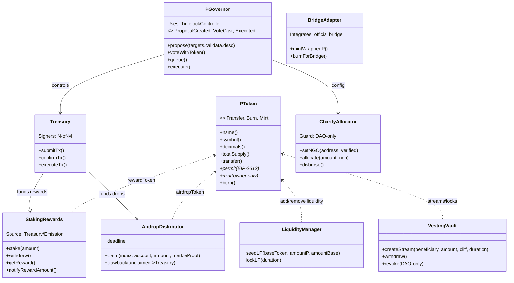

# P‑Coin DApp Integration — Mermaid Diagrams Only

```mermaid
flowchart TD
  U[Users<br/>Donors • Holders • Merchants • Players] --> W[Wallets<br/>MetaMask / WalletConnect]
  W --> FE[DApp Frontend<br/>React/Yew + Ethers.js]
  FE -->|read/write| CHAIN[(EVM Network<br/>Base/Polygon/BSC)]
  FE --> IDX[[Indexers<br/>The Graph / Subsquid]]
  FE --> PAY[Payments API<br/>NowPayments/Coinbase Commerce]
  FE --> STOR[(IPFS/Arweave<br/>docs, images)]

  subgraph On-chain Contracts
    TKN[PToken (ERC20)]
    DAO[PGovernor (DAO) + Timelock]
    MST[MultiSig Treasury]
    ALLOC[CharityAllocator]
    AIR[AirdropDistributor<br/>(Merkle + Allowlist)]
    VEST[VestingVaults]
    STAKE[StakingRewards]
    LQ[LiquidityManager]
    BR[BridgeAdapter]
  end

  CHAIN --- TKN
  CHAIN --- DAO
  CHAIN --- MST
  CHAIN --- ALLOC
  CHAIN --- AIR
  CHAIN --- VEST
  CHAIN --- STAKE
  CHAIN --- LQ
  CHAIN --- BR

  ADM[Ops/Admin Panel] --> MST
  ADM --> DAO
  NGO[Verified NGOs] -->|pull grants| ALLOC
  MERCH[Merchants] --> PAY
  PAY --> FE
  IDX --> FE
```

