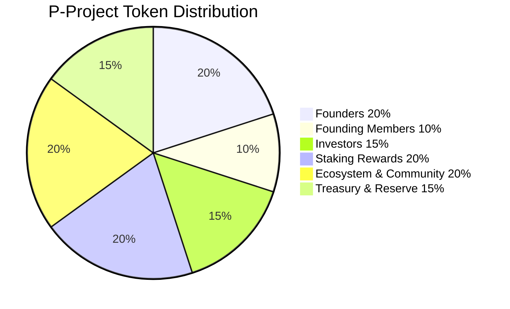
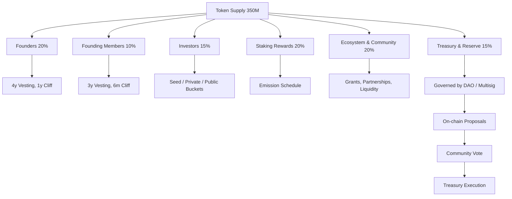

:::mermaid
# P-Project White Paper

## Project Overview and Purpose

P-Project is a decentralized meme coin ecosystem built on blockchain technology with a focus on community-driven governance, sustainable tokenomics, and innovative deflationary mechanisms. The project aims to create a vibrant ecosystem where token holders are rewarded for participation while maintaining long-term value appreciation through carefully designed economic incentives.

The core purpose of P-Project is to:
1. Create a sustainable meme coin with real utility and value proposition
2. Implement deflationary tokenomics with automatic holder rewards
3. Establish a transparent DAO governance system
4. Provide staking opportunities with competitive yields
5. Enable cross-chain compatibility and accessibility

## Tokenomics Details

### Total Supply: 350,000,000 P-Tokens

### Distribution Breakdown:
- Founders: 20% (70,000,000 tokens) - 4-year vesting with 1-year cliff
- Founding Members: 10% (35,000,000 tokens) - 3-year vesting with 6-month cliff
- Investors: 15% (52,500,000 tokens) - Varied vesting schedules
  - Seed Round: 7% (24,500,000 tokens) - 18-month vesting, 3-month cliff
  - Private Round: 5% (17,500,000 tokens) - 24-month vesting, 6-month cliff
  - Public Sale/IDO: 3% (10,500,000 tokens) - 12-month linear vesting, 10% TGE
- Staking Rewards: 20% (70,000,000 tokens) - Distributed over 4 years with halving schedule
- Ecosystem & Community: 20% (70,000,000 tokens) - For grants, partnerships, and liquidity
- Treasury & Reserve: 15% (52,500,000 tokens) - Governed by DAO/Multisig

### Tokenomics Distribution Chart:

### Token Utility Features:
- Automatic burn mechanism on every transaction (1% base burn rate)
- Reflection rewards to all holders (0.5% reward rate)
- Anti-whale measures with 5% maximum transfer limit
- Daily transfer limits to prevent large dumps
- Bot protection with cooldown periods
- Liquidity locking for 24 months

## Technical Implementation

### Core Architecture:
The P-Project ecosystem is built as a modular monorepo with the following components:

1. **p-project-core**: Shared utilities, models, and database connectors
2. **p-project-contracts**: Token logic with advanced security features
3. **p-project-api**: RESTful API server for user interactions
4. **p-project-dao**: Governance system for community proposals
5. **p-project-staking**: Staking service with yield farming capabilities
6. **p-project-airdrop**: Distribution system for early adopters
7. **p-project-bridge**: Cross-chain bridge supporting multiple networks
8. **p-project-web**: WebAssembly-powered frontend UI

### Key Technical Features:
- Rust programming language for performance and memory safety
- MySQL, Redis, and MongoDB for data persistence
- Real-time web interface with mobile responsiveness
- Modular, scalable design for easy maintenance and upgrades
- Comprehensive test coverage (48+ automated tests)

### Vesting Implementation:
All team allocations are protected with smart contract vesting:
- Founders: 4-year vesting with 1-year cliff
- Founding Members: 3-year vesting with 6-month cliff
- Investors: Varied schedules based on round type
- Team Members: 12-month cliff with 24-month linear vesting

## Security Features

### Multi-Layered Protection:
1. **Wallet Restrictions**: Controlled access for team wallets
2. **Daily Transfer Limits**: Maximum 3% of total supply per day
3. **Bot Protection**: 60-second cooldown periods between transactions
4. **Anti-Whale Mechanisms**: 5% maximum transfer limit
5. **Liquidity Locking**: 24-month LP token locking
6. **Multi-Sig Approvals**: Required for treasury transactions
7. **Dynamic Burn Rate**: Increases during high activity periods

### Vesting Contract Security:
- Immutable vesting schedules that cannot be altered
- Time-based release mechanisms preventing immediate dumping
- Multi-sig requirements for founder actions
- Comprehensive error handling and validation

### Token Contract Security:
- Reflection rewards distributed to all holders automatically
- Deflationary mechanism reduces total supply over time
- Activity-based dynamic burn rates to discourage botting
- Comprehensive event logging for audit trails

## Distribution Plan

### Team Distribution:
- 2 Founders: 35,000,000 tokens each with 4-year vesting
- 13 Founding Members: 2,692,307 tokens each with 3-year vesting

### Investor Distribution:
- Seed Round: 24,500,000 tokens with 18-month vesting
- Private Round: 17,500,000 tokens with 24-month vesting
- Public Sale/IDO: 10,500,000 tokens with 12-month vesting

### Community Distribution:
- Staking Rewards: 70,000,000 tokens distributed over 4 years
- Airdrop Program: 52,500,000 tokens for early adopters
- Ecosystem Fund: 70,000,000 tokens for partnerships and growth

### Implementation Timeline:
1. Smart contract deployment and audit
2. Team and investor vesting schedule creation
3. Liquidity seeding and locking
4. Public sale/IDO launch
5. Staking platform activation
6. DAO governance implementation
7. Cross-chain bridge deployment

## Governance Structure

The project is governed by a DAO system with the following structure:
- Treasury & Reserve (15%) controlled by DAO/Multisig
- On-chain proposals for major decisions
- Community voting for proposal approval
- Treasury execution based on approved proposals

## Tokenomics Governance Diagram

## Conclusion

P-Project represents a comprehensive approach to meme coin development with sustainable tokenomics, robust security features, and community-driven governance. The implementation provides a solid foundation for long-term growth while protecting investors through vesting schedules and anti-dump mechanisms.

:::